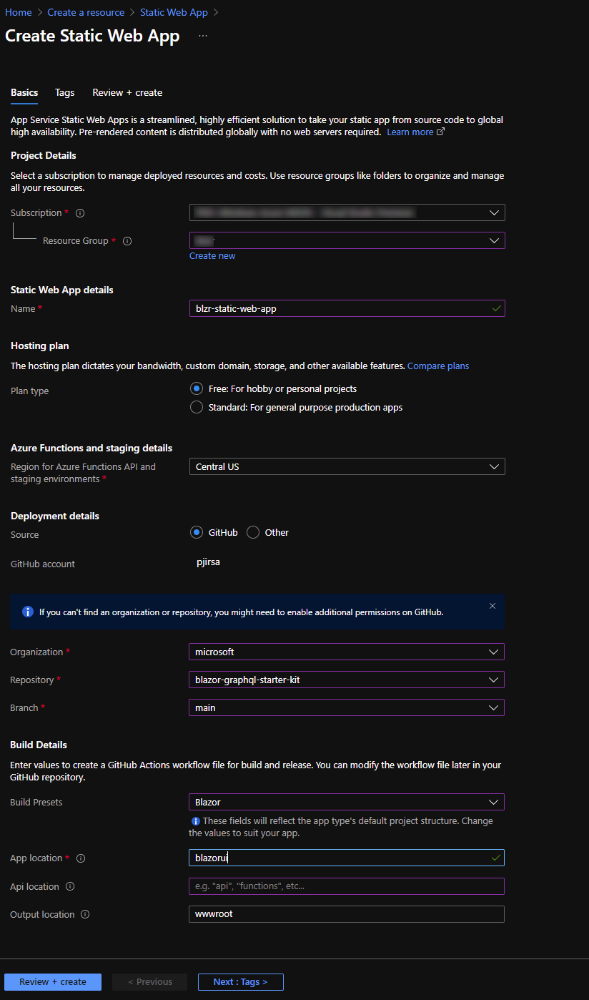

# Project

## How did this template come about?

We wanted to create a one stop tutorial for anyone wanting to create their own Blazor WASM application backed by GraphQL / EntityFramework. 

> **Go [check out](https://github.com/microsoft/emerging-opportunities/blob/main/MotherBox/Readme.md) our internal tool that inspired us to create this template**

> This repo contains sample code for creating a secure app with the following stack.
> UI: Blazor Web Assembly (WASM)
> API: GraphQL based on the HotChocolate package

[What is a GraphQL?](https://github.com/microsoft/emerging-opportunities/tree/main/MotherBox/GraphQL)

> In this app the UI uses Azure AD for auth.  The API is protected and only accepts authorized requests with a valid Oaauth token.


## Steps to deploy in your Azure subscription

### Azure Storage Static Site
<hr/>
Follow these instructions to create a static site: https://docs.microsoft.com/en-us/azure/storage/blobs/storage-blob-static-website

Example name used in this starter kit: _blazorgraphqlui_


### Azure App Service (.NET core, Windows)
<hr/>
Follow these instructions to create a .NET Windows site: https://docs.microsoft.com/en-us/azure/app-service/quickstart-arm-template?pivots=platform-linux

Example name used in this starter kit: _blazorgraphqlapi_

### Azure Static Web App
<hr/>

Azure Static Web Apps provides two options for deployment configuration:
- Github
- Other

#### Github
When choosing the 'Github' deployment option, Azure Static Web Apps will add a Github action to your selected repository. This will automatically build and deploy your site whenever a code change is pushed.

Browse to the Azure Portal and create a new Azure Static Web App using this [quick start guide](https://docs.microsoft.com/en-us/azure/static-web-apps/get-started-portal?tabs=vanilla-javascript#create-a-static-web-app)

> ** Note that you are not deploying an API to Azure Functions with this starter kit **

Your configuration should look similar to the following:



1. Click "Review+Create" to review your settings
1. Click "Create"

#### Other
When choosing the 'Other' deployment option, Azure Static Web Apps will provide you with a Deployment Token. This can be used to establish a secure connection from other devops systems.

In this example, we will be using Azure DevOps.

Follow this guide to configure [Deployment from Azure DevOps](https://docs.microsoft.com/en-us/azure/static-web-apps/publish-devops#create-a-static-web-app)

After step 4, your YAML should look like the following:

```YAML
trigger:
  - main

pool:
  vmImage: ubuntu-latest

steps:
  - checkout: self
    submodules: true
  - task: AzureStaticWebApp@0
    inputs:
      app_location: 'blazorui'
      api_location: ''
      output_location: 'wwwroot'
      azure_static_web_apps_api_token: $(deployment_token)
```

<hr/>

## Azure AD

> Go and read more about [Authentication and Authorization in AzureAd](https://github.com/microsoft/emerging-opportunities/tree/main/.NET/Authentication)

### Create API App Registration

1. Name: _blazor-graphql-api_
2. Select Multi or Single Tenant (we used single tenant for our example)
3. Redirect URL: 
  - https://localhost:<port>/.auth/login/aad/callback 
  - https://blazorgraphqlapi.azurewebsites.net/.auth/login/aad/callbackClick 
4. "Certificates and Secrets" and add a new secret. **Please store it somewhere safe**
5. Click Expose API 
  - Add a new scope: leave the api url the same (ex: api://x8xxd1e-141c-xxxxxx-32aba6f12dxx)
  - scope: graphql.all
    - Who can consent: Admins and users
      - Fill out consent title and descripton for both Admin and User
  

_Things you will need for further setup (copy somewhere)_

**Client ID**

**Client Secret**
  
**API Url** (ex: api://18715d1e-141c-445e-999c-432aba6f12d2))
  
**Tenant ID**


### Create UI App Registration

Name: (*for example*)
blazor-graphql-ui

Accounts in this organization (single or multi)
    
Redirect URLs: 
    - (Single Page App): https://localhost:5001/authentication/callback 
    - https://blazorgraphqlui.azurewebsites.net/authentication/callback

Click on Authentication
  - Check both ID Token and Access Token boxes
  - Click **+ Add a Platform** and add Single Page Application and put down the callback url (for example, https://localhost:44362/authentication/login-callback)

_If you want to separately test out the API with out the blazor portion you can use apps like *Postman*._

    - Add Web Redirect URL (for example, https://oauth.pstmn.io/v1/callback)
    - *If you have Multifactor Auth you must use Authorize wtih PKCE in the postman app.*

**Add API Permissions**

* In the portal click on API Permissions
* Click + Add a New Permission
* Click on "My APIs"
* Click on the API you exposed earlier (for example: blazor-graphql-api)
* Check the checkbox for 'graphql.all'
* Click 'Add Permission'

_Things you will need for further setup (copy somewhere)_

**Client ID**

**Tenant ID**

## Tie the UI and the API registration
    
Now go back to the App Registration you created for the API.

Click on Expose an API

And add the UI app's client ID to the list of authorized Apps.'

### Blazor App
    
From Nothing:

* Create new VS Solution with a Blazor App with Microsoft Identity Provider Auth.
----
* Open the solution file
* Edit the app-settings.json file with your client id and tenant
EX (Note below values are not valid and need to be replaced with valid values
```json
  "APIBaseURL": "https://blazorgraphqlapi.azurewebsites.net",
  "APIScope": "api://187<replace..........>2d2/graphql.all",
  "AzureAd": {
    "Authority": "https://login.microsoftonline.com/5df988bf-86f1-41af-91ab-2d7cd011db47",
    "ClientId": "2c92f0fd-70bf-468a-83d7-94f8a3074650",
    "ValidateAuthority": true
  }
}
```

* Run locally (Press F5)
If your app runs on https://localhost:44362 then you should be able to login.  If your app runs on another port or runs in http then please change the blazor-graphql app registration's reply_url.'

* Create an Azure Static Blob site
* Enable static website hosting: https://docs.microsoft.com/en-us/azure/storage/blobs/storage-blob-static-website-how-to?tabs=azure-portal#enable-static-website-hosting
* Configure the Azure Static Blob Site
* Deploy to a static blob site


* Use Azure Active Directory (AAD) for authentication: https://docs.microsoft.com/en-us/aspnet/core/blazor/security/webassembly/standalone-with-azure-active-directory?view=aspnetcore-5.0

### .Net Core Api (with GraphQL)

* Create new VS Solution with a .Net Core Api with Microsoft Identity Provider Auth.
----
* Open the solution file
* Edit the app-settings.json file with your client id and tenant
EX (Note below values are not valid and need to be replaced with valid values
```json
  {
  "AzureAd": {
    "Instance": "https://login.microsoftonline.com/",
    "Domain": "<name your tenant>.onmicrosoft.com",
    "TenantId": "<Tenant id>",
    "ClientId": "<API app regisration ID>",
    "ClientSecret": "<API app regisration SECRET>"
  }
}
```
## Additional Resources
* What is Blazor - https://docs.microsoft.com/en-us/aspnet/core/blazor/?view=aspnetcore-5.0

* Build your first Blazor app - https://dotnet.microsoft.com/learn/aspnet/blazor-tutorial/intro

## Contributing

This project welcomes contributions and suggestions.  Most contributions require you to agree to a
Contributor License Agreement (CLA) declaring that you have the right to, and actually do, grant us
the rights to use your contribution. For details, visit https://cla.opensource.microsoft.com.

When you submit a pull request, a CLA bot will automatically determine whether you need to provide
a CLA and decorate the PR appropriately (e.g., status check, comment). Simply follow the instructions
provided by the bot. You will only need to do this once across all repos using our CLA.

This project has adopted the [Microsoft Open Source Code of Conduct](https://opensource.microsoft.com/codeofconduct/).
For more information see the [Code of Conduct FAQ](https://opensource.microsoft.com/codeofconduct/faq/) or
contact [opencode@microsoft.com](mailto:opencode@microsoft.com) with any additional questions or comments.

## Trademarks

This project may contain trademarks or logos for projects, products, or services. Authorized use of Microsoft 
trademarks or logos is subject to and must follow 
[Microsoft's Trademark & Brand Guidelines](https://www.microsoft.com/en-us/legal/intellectualproperty/trademarks/usage/general).
Use of Microsoft trademarks or logos in modified versions of this project must not cause confusion or imply Microsoft sponsorship.
Any use of third-party trademarks or logos are subject to those third-party's policies.
